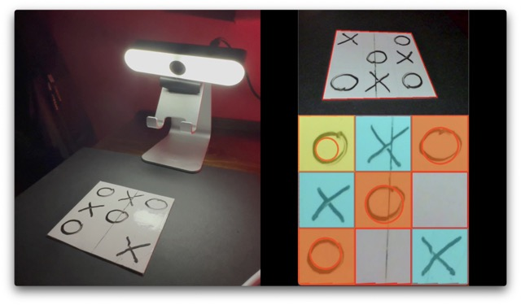

# Tris with Computer Vision

|   |
| :--: |
|*Click to Watch video of Tris with Computer Vision* |

## Project Description

This project implements a hybrid Tic Tac Toe game mode, combining the physical medium of pen and paper with a computer vision system. 

I used Python and OpenCV to capture the image of the physical board with a webcam, recognise the symbols drawn by the player and respond to human moves.

Creating the workflow for processing the image was pretty challenging, but the result is reliable and effective!

## How to install and run

You need to have a Python interpreter on your computer and a webcam.

Clone the repository:

`git clone https://github.com/massimobottelli/tris-computer-vision.git`
 
Install the dependencies

`pip install -r requirements.txt`
 
Then launch the script:

`python tris-cv.py`

## How to play

To play, the user must place a square board on the desktop and frame it with the webcam: the webcam does not have to be positioned exactly above the board because the software is able to correct the perspective.

At each turn, the human player draws the symbol (O) and clicks a key on the keyboard.

The computer captures the board image from the webcam, analyses it and responds with its move by placing the symbol (X) on the window on the screen.

The human player must manually draw the X on the board in the cell displayed by the computer.

The game ends when a player places three of his symbols in a row, in a column or diagonally.

## How it works

The software is coded in Python and uses the OpenCV library to capture and process the image from the webcam.

The image processing workflow consists of the following steps:

1. capture the perspective image from the webcam
2. identify the board contour, approximate it to a quadrilateral and detect the coordinates of the angles
3. transform the perspective image into a planar image by transforming the coordinates of the angles
4. draw a grid of 3 x 3 cells as an overlay
5. check the contents of each cell to detect non-empty cells
6. for non-empty cells, detect if it contains the shape of the circle
7. based on the symbol detected, overlay a different colour on the cell for the human or computer player.

After processing the image, the software analyses the contents of the board to detect whether a player has placed three symbols on a row.

If there is no winner, the software evaluates the best move for the computer player:
- if there are two symbols (X) of the computer player on a line, it responds with the winning move to complete the line of three
- if there are two human player symbols (O) on a line, it responds with the blocking move to prevent the human player from winning
- if there is neither the winning move nor the blocking move, he responds with a random move on any empty cell

## Next steps

I plan to improve the project by creating a robot arm to allow the computer to draw its own symbol.
