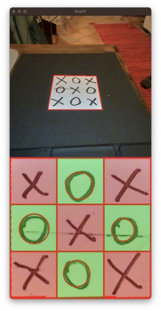

# Tris with computer vision

In this code, `create_coords()` function creates a list of coordinates for each cell in a 3x3 grid based on the configuration parameters defined in the `config.yaml` file. The list is then used in `draw_grid()` function to draw a reference grid on the video frame. The grid is used to align the webcam so that each cell is in the correct position.

The `get_frame()` function reads a frame from the webcam, crops it to a square, resizes it, and flips it horizontally and vertically.

The main code starts by creating the list of cell coordinates and initializing the video capture object. It then enters a loop where it continuously reads frames from the webcam and displays them on the screen until the space key is pressed. The `draw_grid()` function is called to draw the reference grid on each frame.

At this point, the code needs to check each cell to see if it is empty or contains a circle. This will be done in the `check_cell()` and `detect_circle()` functions, which will be called from within the loop.

`check_cell()` function takes as input the coordinates of a cell and extracts the region of interest (ROI) from the frame corresponding to that cell. It converts the ROI to grayscale, thresholds it to obtain a binary mask, and computes the percentage of the masked area. If the percentage is greater than a threshold (defined in the configuration file), the function returns the mask and the percentage. Otherwise, it returns None.

`detect_circle()` function takes as input a binary mask of a cell and uses the Hough Circle Transform to detect any circles in the cell. If a circle is detected, the function returns True and draws the circle on the frame. Otherwise, it returns False.
